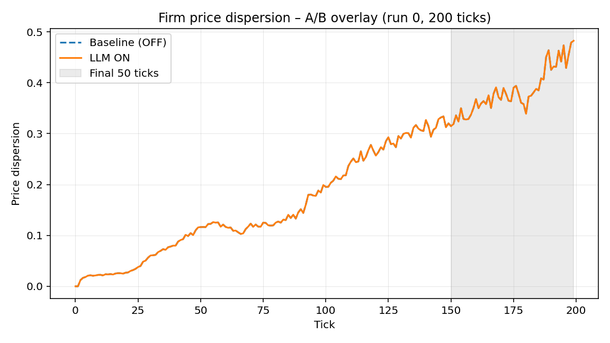

## Directory layout

- **Figures** live under `figs/<section>/` (e.g., `figs/firm/firm_ab_overlay.png`).
- **Tables / metrics** live under `data/<section>/` (e.g., `data/firm/firm_ab_table.csv`).
- Use lowercase, hyphenated filenames. Keep the `_<suffix>` (`overlay`, `table`, `panel`, etc.) to signal chart/table type.
- Temporary or illustrative assets go in `_examples/` so they are easy to prune later.

## Filenames & labels

| asset type | pattern | example |
| --- | --- | --- |
| Firm A/B overlay figure | `figs/firm/firm_ab_overlay.png` | `figs/firm/firm_ab_overlay.png` |
| Bank A/B table | `data/bank/bank_ab_table.csv` | `data/bank/bank_ab_table.csv` |
| Wage scenario panels | `figs/experiments/exp_<scenario>_panel.png` | `figs/experiments/exp_A_panel.png` |
| Robustness tables | `data/robustness/robustness_<topic>_table.csv` | `data/robustness/robustness_beta_table.csv` |

Label figures/tables in Quarto so they can be cited inline:

```markdown
{#fig-firm-ab}

::: {.table #tbl-firm-ab}
| scenario | metric | value |
| --- | --- | --- |
| baseline | price_dispersion | 0.012 |
| llm_on | price_dispersion | 0.009 |
:::
```

## Referencing in Quarto

- Always add an explicit label (`{#fig-...}` or `{#tbl-...}`) after the asset so cross references work (`see @fig-firm-ab`).
- Keep captions concise; state units when relevant (e.g., "spreads (percentage points)").
- CSVs store raw values; rounding happens in the Quarto table render layer.

## Example assets in this repo

- `figs/_examples/sample_overlay.png`
- `data/_examples/sample_metrics.csv`

These are referenced from `docs/index.qmd` to demonstrate the convention end-to-end.
